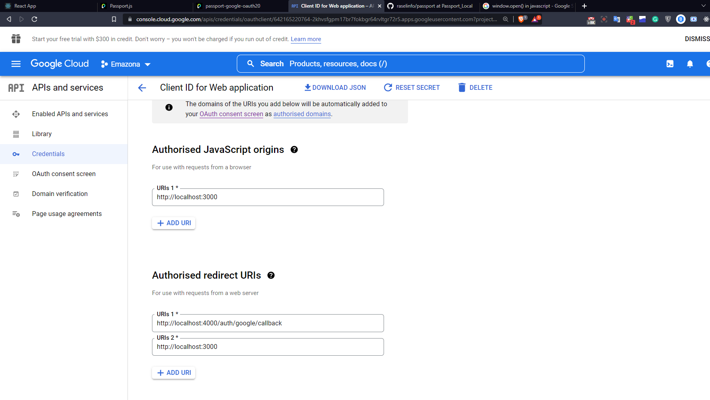

- Create a project
- Create a OAuth consent screen
- Create Credentials
  - OAuth Client Id
  - OAuth Client Secret Id



follow this repo : <a href="https://github.com/safak/youtube/blob/react-social-login/client/src/App.jsx">Click </a>


In frontend you can call the router like this way /auth/login/success
```js
const getUser = async() => {
      const data = await axios.get("http://localhost:4000/auth/login/success", {
        withCredentials: true,
      });
      console.log(data)
      
    };
    getUser();
  }, []);
```